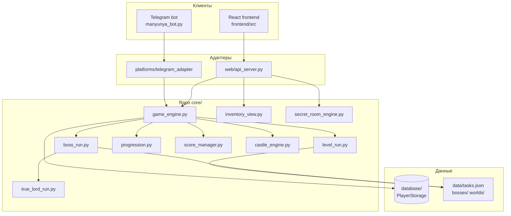

# Архитектура Chislyandia

Проект: образовательная игра по математике.  
Две клиентские поверхности — **Telegram-бот** и **Web (React + Flask)** — используют **одно ядро** и **одну SQLite-БД** на каждом окружении.

## Слои

## Принцип

- **Бизнес-логика** — только в `core/` (и точечно в `handlers/` для Telegram UI).
- **Flask** (`web/api_server.py`) — тонкий прокси: валидация JSON → вызов `ChislyandiaEngine` → ответ.
- **React** — только UI и вызовы через `frontend/src/adapters/botAdapter.js`.
- **Не дублировать** правила игры во фронте или в API.

## Web-поток (типичный)

1. Экран вызывает метод из `botAdapter.js`.
2. Flask-эндпоинт (`/api/game/...`, `/api/inventory/...` и т.д.).
3. `ChislyandiaEngine` или прямой импорт модуля (`inventory_view`, `secret_room_engine`).
4. `PlayerStorage` читает/пишет `data/progress.db`.
5. JSON-ответ → экран обновляет состояние.

Бои с боссом: `check_answer` → `game_engine.solve_task()` → при `in_boss_battle` делегирует в `boss_run` или `true_lord_run`.

## Telegram-поток (кратко)

1. `manyunya_bot.py` — точка входа, polling.
2. `handlers/*` — команды, callback, сообщения.
3. Те же `core/*` и `database/storage.py`, что и web.

Эпический Истинный Владыка в TG: `handlers/true_lord_battle.py` (отдельный от generic `handlers/bosses.py`).

## Ключевые модули ядра

| Модуль | Назначение |
|--------|------------|
| `game_engine.py` | Центр: профиль, ответы, банк, замок, артефакты, алхимия |
| `level_run.py` | Забег по острову (10 задач), XP, завершение мира |
| `progression.py` | Каталог миров, `unlocked_zones` |
| `boss_run.py` | Обычные боссы (5 HP), каталог, разблокировки |
| `true_lord_run.py` | Эпик Истинного Владыки (20 HP, фазы, диалоги) |
| `task_loader.py` | Загрузка задач из `data/worlds/` |
| `score_manager.py` | Баланс, начисления, штрафы |
| `castle_engine.py` | Замок, декорации, upkeep |
| `inventory_view.py` | API-представление инвентаря (без Telegram) |
| `item_display.py` | Названия предметов для web |
| `secret_room_engine.py` | Тайная комната |
| `player_profile_view.py` | Расширенный профиль для web |

## Данные

- **БД:** `data/progress.db` — прогресс игрока (`users`, game state в JSON-полях).
- **Контент:** `data/tasks.json`, `data/bosses/*.json`, `data/worlds/`, `data/bosses_info.json`.
- **Картинки:** `images/` (в т.ч. `true_lord_*.jpg` для web через nginx `/images/`).

Локальная БД бота и БД на VPS — **разные файлы** (синхронизация в техдолге).

## Где что менять (шпаргалка)

| Задача | Файлы |
|--------|--------|
| Новый API-эндпоинт | `core/*` → `game_engine.py` → `web/api_server.py` → `botAdapter.js` |
| Новый экран web | `frontend/src/screens/*` → `App.jsx` → `docs/FRONTEND.md` |
| Правила босса | `core/boss_run.py` |
| Истинный Владыка (web) | `core/true_lord_run.py`, `TrueLordScreen.jsx` |
| Разблокировка миров | `core/boss_run.py`, `core/progression.py`, `core/level_run.py` |
| Инвентарь | `core/inventory_view.py`, `InventoryScreen.jsx` |
| Деплой staging | `scripts/deploy-staging.ps1`, `deploy/nginx-chislyandia.conf` |

## Тесты

Smoke-тесты API: `tests/test_api_smoke.py`  
Запуск: `.\scripts\run-tests.ps1`

После изменений в API или ядре — прогонять тесты перед деплоем.
